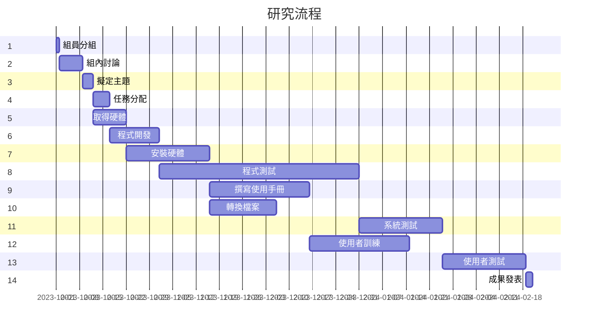

# PERT圖

# 甘特圖

```mermaid
gantt
    title 研究流程
    section 1
    組員分組     :a1, 2023-10-01, 1d
    section 2
    組內討論     :a2, after a1  , 7d
    section 3
    擬定主題     :a3, after a2  , 3d
    section 4
    任務分配     :a4, after a3  , 5d
    section 5
    取得硬體     :a5, after a3   ,10d
    section 6
    程式開發     :a6, after a4   ,15d
    section 7
    安裝硬體     :a7, after a5 ,25d
    section 8
    程式測試     :a8, after a6 ,60d
    section 9
    撰寫使用手冊     :a9, after a7 ,30d
    section 10
    轉換檔案    :a10,after a7  , 20d
    section 11
    系統測試     :a11,after a8 , 25d
    section 12
    使用者訓練    :a12, after a9 , 30d
    section 13
    使用者測試    :a13, after a11 , 25d
    section 14
    成果發表     :a14, after a13 ,2d
```
